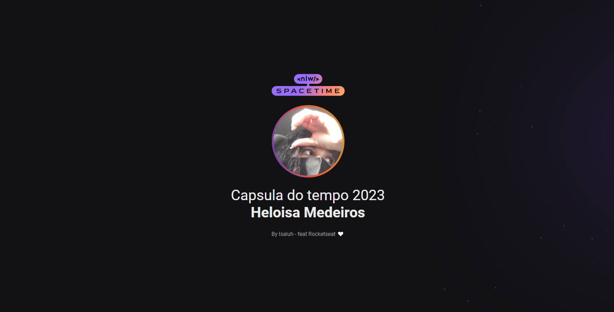

<h1 align="center"> NLW - SPACETIME </h1>

Na trilha Explorer desenvolvemos uma aplicação Web responsiva de recordação de memórias utilizando HTML, CSS e deploy com Github Pages. Nessa aplicação é adicionada "memórias" à uma timeline de acontecimentos da sua vida. No meu caso, coloquei sobre as atualizações do github nesse ano. 

  <a href="#-tecnologias">Tecnologias</a>&nbsp;&nbsp;&nbsp;|&nbsp;&nbsp;&nbsp;
  <a href="#-projeto">Projeto</a>&nbsp;&nbsp;&nbsp;|&nbsp;&nbsp;&nbsp;
  <a href="#-layout">Layout</a>

 

  

## 🎓 Tecnologias

Esse projeto foi desenvolvido com as seguintes tecnologias:

- HTML e CSS
- Git e Github
- Figma

## 📔 Projeto

Timeline dos projetos feitos por mim no ano de 2023.

- [Visite o projeto online](https://isaluh.github.io/nlwSpacetime)

## 🏯 Layout

Visualise o layout do projeto através [desse link](https://www.figma.com/file/8PVhEmLsbxyCxFz5O0Xs0D/C%C3%A1psula-do-tempo-%E2%80%A2-Trilha-Explorer-(Community)?type=design&node-id=306-3&t=BBboXxcYiPP7wxpS-0). É necessário ter conta no [Figma](https://figma.com) para acessá-lo.

---

<h4 align="center">By: Isaluh - feat: Rocketseat 🤍</h4>